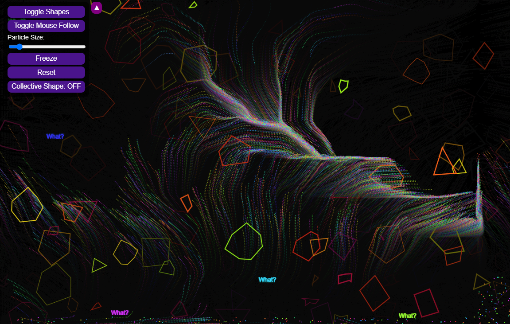
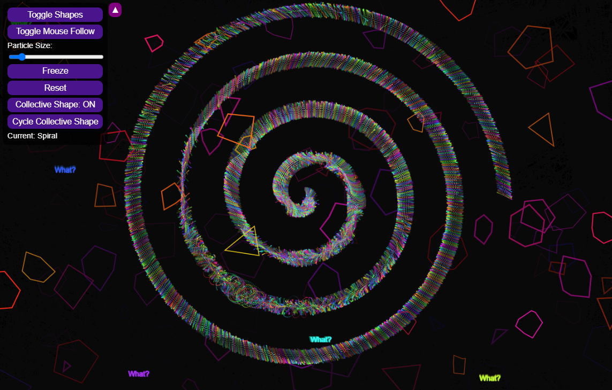
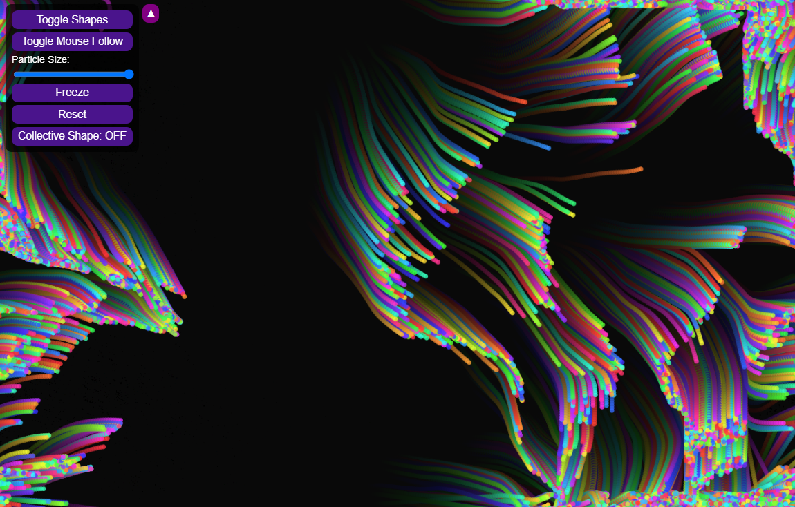
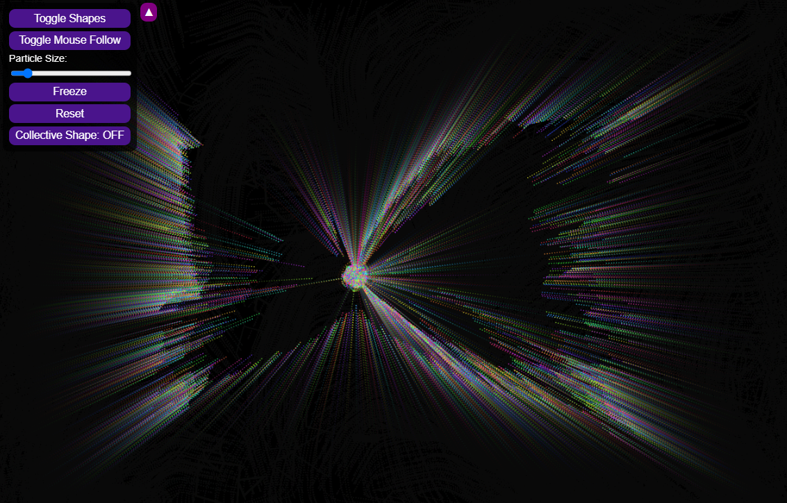

# Gone

A visual experiment with shapes, particles, generative patterns, fractals, and mathematical art, all crafted using JavaScript.

## Features

- **Interactive UI:** Control the movement and patterns of particles using different features.
- **Particle Patterns:**
  - Fractal Trees
  - Fibonacci Spirals
  - 5 point Star 
  - Circles and Spirals
- **Smooth Transitions** between each pattern/shape
- **Mouse Interaction:** Button to make particles follow the mouse cursor.
- **Particle Size Adjustment:** Use a slider to change particle sizes.
- **Freeze button:** Freeze and unfreeze the entire screen. 
- **Reset Button:** Restore the page to its original state.
- **Collective Shape Mode:** Toggle particles between their usual free movement, and forming collective shapes, with the ability to cycle through different patterns.
- **Toggle Menu:** Show or hide the control panel using the menu toggle button.
 

## How to Use

1. Open the page: [Gone](https://frogtato.github.io/gone/)
  
## Technologies Used

- **HTML5:** Structure and layout.
- **CSS3:** Styling and responsive ui.
- **JavaScript (p5.js):** Particle system and animations.

## Previews

## License

This project is licensed under the **Creative Commons Attribution 4.0 International (CC BY 4.0)**. See the [LICENSE](LICENSE) file for details.

## Author

Created by **Frogtato** (172 Worms)
